# QuizFlip

A simple flashcards application that allows users to create quizzes with front and back values for each card.
Users can create multiple quizzes, edit them, and swipe through cards to mark them as correct or wrong.
The app then provides a summary of the quiz.

## Screenshots

<p align="middle">
    <h2>Home screen</h2>
  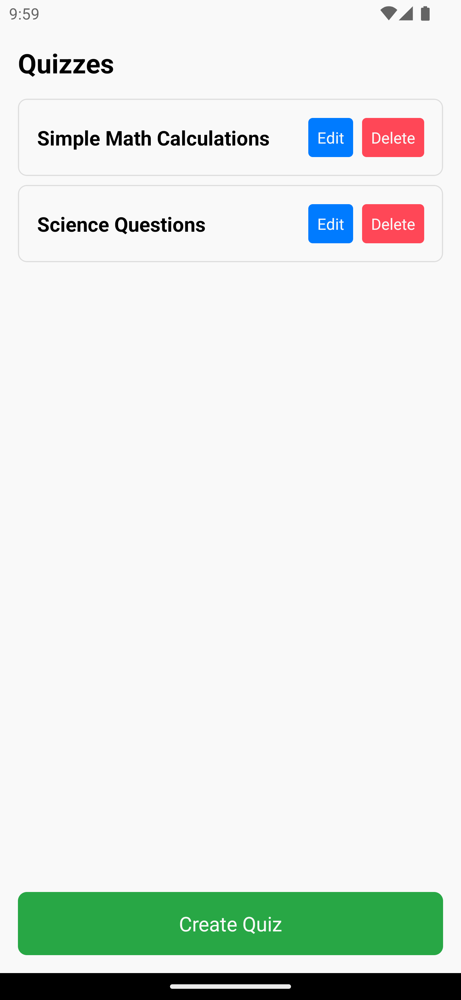
  <br />
  <h2>Create / Edit Quiz</h2>
  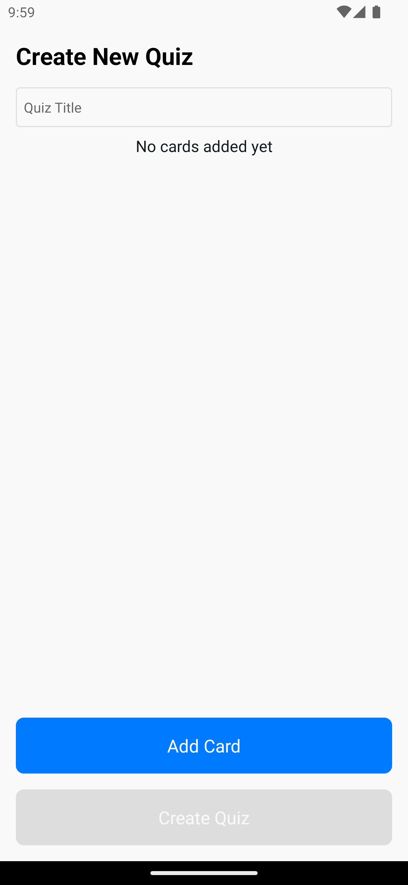
  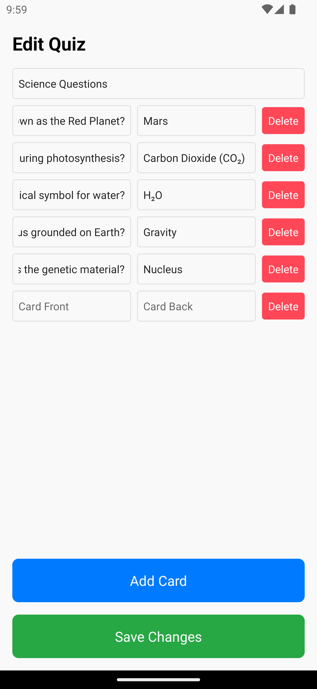
  <br />
  <h2>Quiz</h2>
  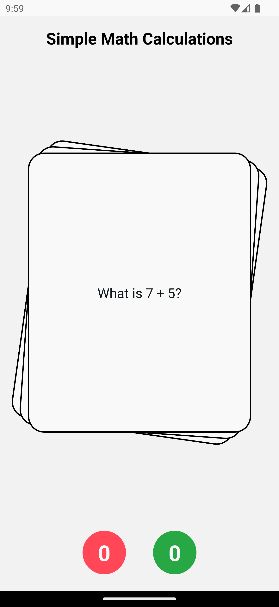
  <br />
  <h2>Swipe right for correct</h2>
  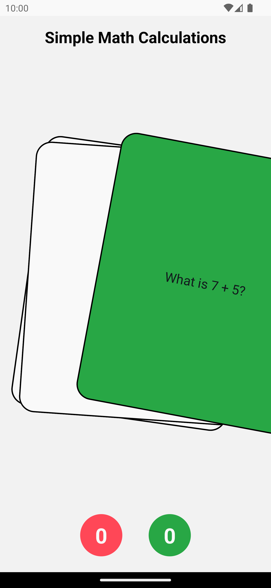
  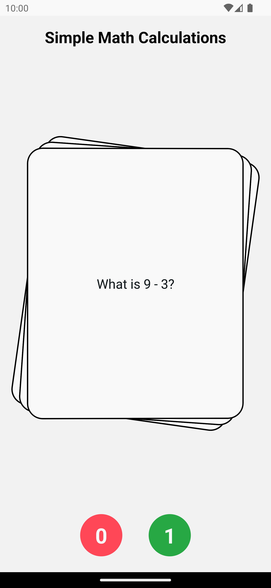
  <br />
  <h2>Swipe left for wrong</h2>
  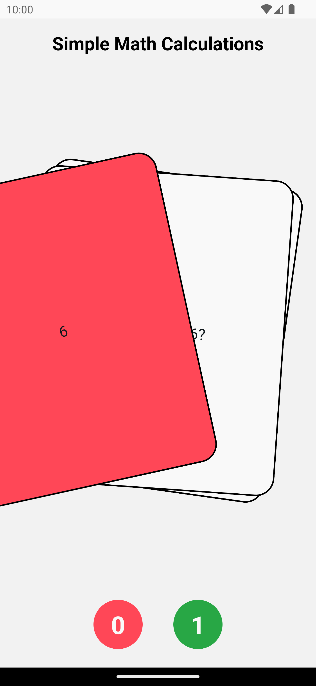
  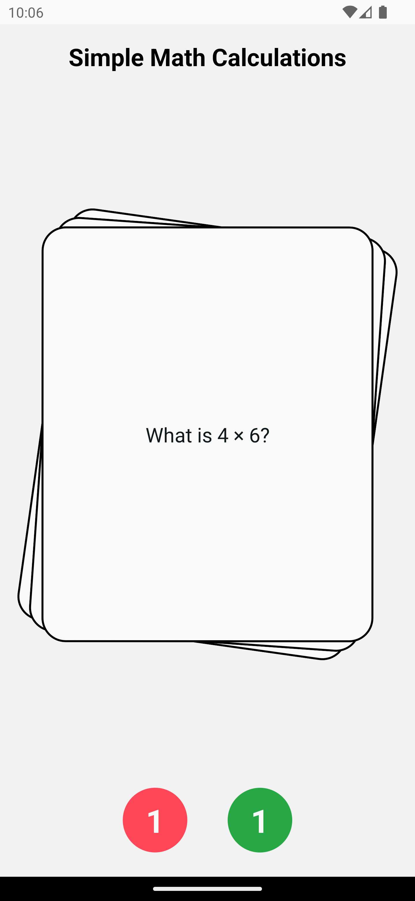
  <br />
  <h2>Front and back of the card</h2>
  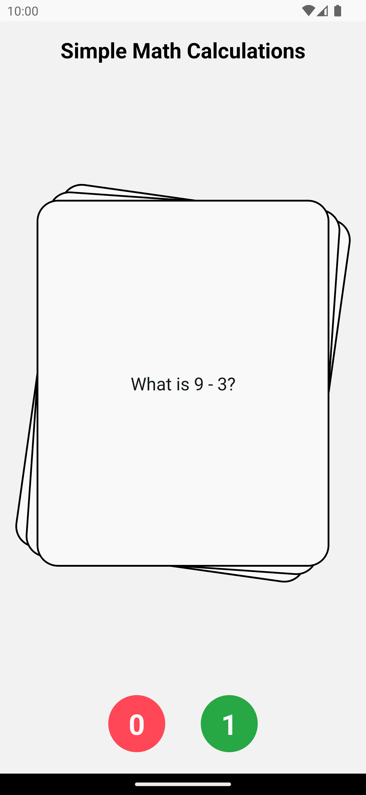
  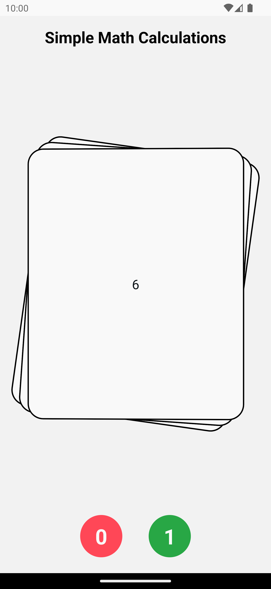
  <br />
  <h2>Summary</h2>
  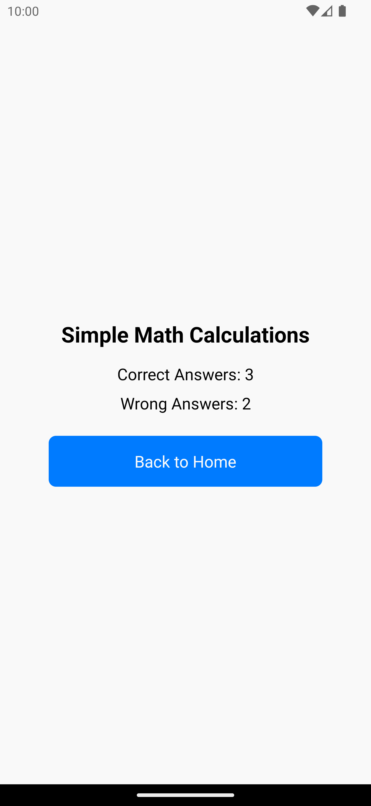
</p>

## Features

- Browse quizzes
- Create and edit quizzes
- Add and remove flashcards within quizzes
- Swipe through cards to mark as correct or incorrect
- View a summary of quiz results
- Data persistance in async storage

## Screens

1. **Home Screen**
   - Displays a list of all quizzes
   - Each quiz entry is pressable to start the quiz
   - Edit and delete buttons for each quiz
2. **Quiz Screen**
   - Swipe through cards
   - Swipe right to mark as correct
   - Swipe left to mark as wrong
3. **Quiz Summary Screen**
   - Shows title of completed quiz
   - Displays the number of correct and incorrect answers
4. **Create New Quiz / Edit Quiz Screen**
   - Create new or edit existing quizzes
   - Add or remove cards
   - Edit the front and back of each card on the fly

## Installation

1. Clone the repository:

   ```sh
   git clone https://github.com/rkonde/QuizFlip.git
   cd QuizFlip
   ```

2. Install dependencies:

   ```sh
   npm install
   ```

3. Run the app:

   ```sh
   npm start
   ```
